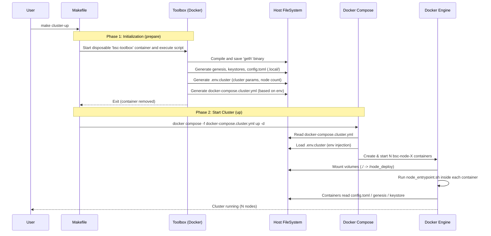

# Deployment tools of BSC


## Installation
Before proceeding to the next steps, please ensure that the following packages and softwares are well installed in your local machine: 

> [!TIP]
> **Don't want to install these manually?** You can skip to the [Docker Version](#docker-version-recommended) section at the bottom of this file.

- nodejs: v16.15.0
- npm: 6.14.6
- go: 1.24+
- foundry
- python3 3.12.x
- poetry
- jq


## Quick Start
1. Clone this repository
```bash
git clone https://github.com/bnb-chain/node-deploy.git
```

2. For the first time, please execute the following command
```bash
pip3 install -r requirements.txt
```

3. build `create-validator`

```bash
# This tool is used to register the validators into StakeHub.
cd create-validator
go build
```

4. Configure the cluster
```
  You can configure the cluster by modifying the following files:
   - `config.toml`
   - `genesis/genesis-template.json`
   - `genesis/scripts/init_holders.template`
   - `.env`
```

5. Setup all nodes.
two different ways, choose as you like.
```bash
bash -x ./bsc_cluster.sh reset # will reset the cluster and start
# The 'vidx' parameter is optional. If provided, its value must be in the range [0, ${BSC_CLUSTER_SIZE}). If omitted, it affects all clusters.
bash -x ./bsc_cluster.sh stop [vidx] # Stops the cluster
bash -x ./bsc_cluster.sh start [vidx] # only start the cluster
bash -x ./bsc_cluster.sh restart [vidx] # start the cluster after stopping it
```

6. Setup a full node.
If you want to run a full node to test snap/full syncing, you can run:

> Attention: it relies on the validator cluster, so you should set up validators by `bsc_cluster.sh` firstly.

```bash
# reset a full sync node0
bash +x ./bsc_fullnode.sh reset 0 full
# reset a snap sync node1
bash +x ./bsc_fullnode.sh reset 1 snap
# restart the snap sync node1
bash +x ./bsc_fullnode.sh restart 1 snap
# stop the snap sync node1
bash +x ./bsc_fullnode.sh stop 1 snap
# clean the snap sync node1
bash +x ./bsc_fullnode.sh clean 1 snap
# reset a full sync node as fast node
bash +x ./bsc_fullnode.sh reset 2 full "--tries-verify-mode none"
# reset a snap sync node with prune ancient
bash +x ./bsc_fullnode.sh reset 3 snap "--pruneancient"
```

You can see the logs in `.local/fullnode`.

Generally, you need to wait for the validator to produce a certain amount of blocks before starting the full/snap syncing test, such as 1000 blocks.

## Background transactions
```bash
## normal tx
cd txbot
go build
./air-drops

## blob tx
cd txblob
go build
./txblob
```

## Docker Version (Recommended)

To run a fully containerized, isolated local BSC cluster without installing dependencies on your host machine, use the provided `Makefile` which handles the 2-phase orchestration automatically.

### Architecture Workflow



### Quick Commands

- **`make cluster-up`**: One-click start. It runs the initialization phase (using a disposable toolbox container) and then starts the isolated nodes via Docker Compose.
- **`make cluster-down`**: Safely stop all running nodes.
- **`make cluster-logs`**: Stream aggregated, color-coded logs from all running nodes.
- **`make cluster-restart`**: Fast restart the cluster (nodes only). Use this if you manually modified `.local/nodeX/config.toml` and want to apply changes without wiping the blockchain data.
- **`make cluster-clean`**: **WARNING**. Wipes all generated data (`.local/`), genesis files, and temporary yaml configs. Use this to reset the chain back to block zero.

### Node Ports Mapping

Each node runs identically on port `8545` internally. Host mapping is structured sequentially:

| Node | RPC (HTTP/WS) | Metrics (Prometheus) | pprof (Debug) | P2P (TCP/UDP) |
| :--- | :--- | :--- | :--- | :--- |
| **Node 0** | 8545 | 6060 | 7060 | 30311 |
| **Node 1** | 8547 | 6062 | 7062 | 30312 |
| **Node 2** | 8549 | 6064 | 7064 | 30313 |
| **Node 3** | 8551 | 6066 | 7066 | 30314 |

For example, to check the block height of Node 1:
`curl -H "Content-Type: application/json" -X POST --data '{"jsonrpc":"2.0","method":"eth_blockNumber","params":[],"id":1}' http://127.0.0.1:8547`

### Logging

By default, nodes output all their logs directly to the Docker logging driver (STDOUT). You can view them using:
`docker logs -f bsc-node-0`